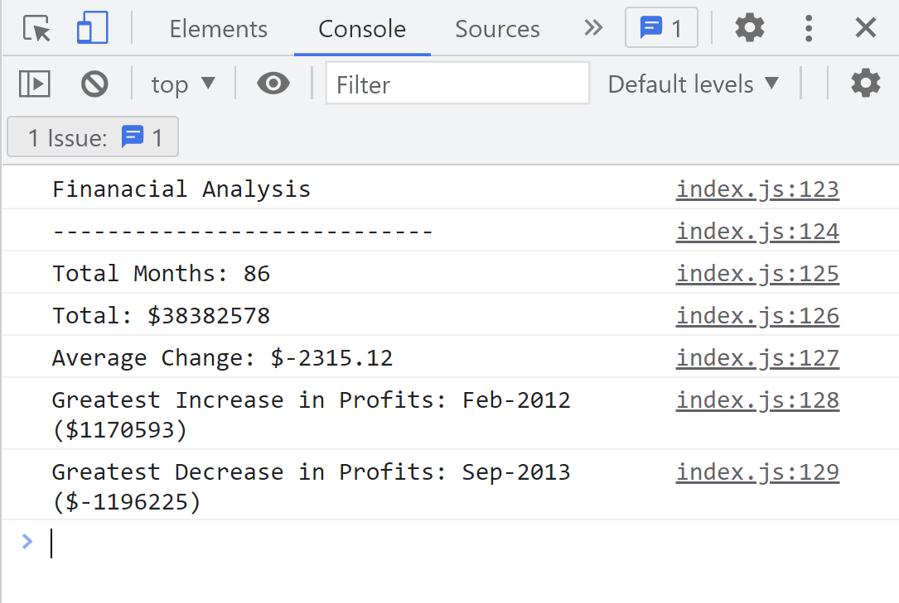

# Console Finances

## Overview

The application is using a given dataset and outputs the followings in the the console:

* The total number of months included in the dataset.

* The net total amount of Profit/Losses over the entire period.

* The average of the **changes** in Profit/Losses over the entire period.

* The greatest increase in profits (date and amount) over the entire period.

* The greatest decrease in losses (date and amount) over the entire period.

&nbsp;

## Mochup

This is the output the application logs in the Console.

&nbsp;

## Copyright

© 2022 George Boholteanu.
  All Rights Reserved.
